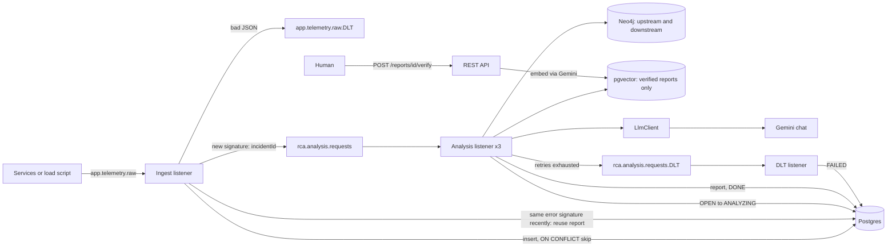

# AI Incident Root Cause Analysis (RCA) Engine

A learning project: error logs arrive on Kafka, the engine looks up the failing service's neighbours in a
Neo4j dependency graph, finds similar **human-verified** past incidents in pgvector, and asks **Google Gemini**
for a structured RCA report that is stored in Postgres.

Java 21, Spring Boot 4, Spring AI 2, Kafka, PostgreSQL + pgvector, Neo4j, Gemini (chat + embeddings),
Resilience4j, Micrometer, Testcontainers.

---

## Why this matters to companies (not just a demo)

Real teams face the same pattern this project models:

| Pain in production | What this project shows |
|---|---|
| Thousands of duplicate alerts during one outage | **Error grouping** by signature: one LLM analysis, many incidents linked |
| "Which service actually broke?" in a mesh | **Neo4j** upstream/downstream paths in the prompt |
| Tribal knowledge in old Slack threads | **RAG** over verified post-mortems in pgvector |
| Slow, manual RCA docs | **Structured JSON** (`rootCause`, confidence, remediations) stored in SQL |
| Alert storms blocking on-call | **Kafka**: fast ingest, slow LLM on a separate topic with retries and DLT |
| Bad AI answers becoming "truth" | **Human verify** before anything enters the knowledge base |
| Cost and rate limits on LLMs | **Metrics + `/stats`**: measure how many calls grouping saved |

Companies would not deploy this repo as-is; they would plug in their **CMDB/service graph**, **log pipeline**
(Fluent Bit, Datadog, Splunk → Kafka), **enterprise Gemini or Vertex**, and **SSO-gated verify APIs**. The
**architecture** (event-driven RCA, graph + vector context, idempotent ingest, DLT) is what interviews and
design reviews care about.

---

## Problem

When one service breaks, engineers get a flood of near-identical errors from several services and have to
work out by hand (a) which service actually caused it and (b) whether this has happened before. This project
automates a first guess:

- **Where could it come from?** Walk the service call graph around the failing service.
- **Have we seen it before?** Search past incidents with a similar meaning, but only ones a human confirmed.
- **What is the likely cause?** Give both to Gemini and get back typed JSON, not free text.

It is a prototype for learning. It has not been run against real production traffic.

---

## Architecture



| Class | Responsibility |
|---|---|
| `TelemetryIngestionService` | Fast path: parse, de-duplicate by `traceId`, group by error signature, publish incident id |
| `IncidentAnalysisService` | Slow path: claim incident, run RCA, save report, set status |
| `RcaOrchestratorService` | Gather context: Neo4j call paths + verified similar incidents from pgvector |
| `LlmClient` | Gemini only; clear error labels; circuit breaker, timeout, metrics |
| `DeadLetterListener` | Marks incidents FAILED and counts DLT messages |
| `ReportService` / `IncidentController` | REST API and the human verification step |
| `ErrorSignature` | Normalises a log message and hashes it |

### Incident status flow

```
OPEN --(worker claims it)--> ANALYZING --(report saved)--> DONE
                                  |
                                  +--(error: back to OPEN, Kafka retries; last retry fails)--> FAILED
```

Incidents that reuse an earlier report are stored directly as `DONE` with `duplicate_of` pointing at the original.

---

## Walkthrough: schema error in account-service

Seeded graph (`GraphDataInitializer`):

```
api-gateway -> signup-service -> account-service
kyc-service -> account-service
```

1. `account-service` logs `SerializationException: ... Expected magic byte 0x00 but found 0x7b ...`
   (it expected Avro, it received JSON).
2. The ingest listener stores incident `OPEN` and publishes its id to `rca.analysis.requests`.
3. The worker claims it (`ANALYZING`) and asks Neo4j for upstream and downstream paths.
4. pgvector is searched for **verified** reports with matching `service` / `exceptionType` above the similarity
   threshold. On a fresh install there are none.
5. Gemini returns `{rootCause, confidence, affectedServices, recommendations}` (often pointing at an upstream
   schema change).
6. The report is saved and the incident becomes `DONE`.
7. An engineer calls `POST /reports/{id}/verify`. Gemini embeds the summary into pgvector for future RAG.
8. Repeated errors with the same signature reuse the report without another LLM call.

---

## How to run

Requirements: Docker, JDK 21, **`SPRING_AI_GOOGLE_GENAI_API_KEY`** ([Google AI Studio](https://aistudio.google.com/)).
Chat model defaults to **`gemini-flash-latest`** (same family as the REST API you tested). Use only synthetic sample data on the free tier.

```powershell
docker compose up -d
$env:SPRING_AI_GOOGLE_GENAI_API_KEY = "<your key>"
.\mvnw.cmd spring-boot:run
```

On startup look for `[STARTUP] Gemini API key is configured`. During RCA, logs use steps **0/4–4/4** and
`[RCA STOPPED at Gemini]` with a category (API key, rate limit, timeout, etc.).

Postgres is on host port **5433** (avoids clashing with a local PostgreSQL on 5432).

### Try it

```powershell
'{"service":"account-service","timestamp":"2026-09-30T10:00:00","traceId":"trace-001","exception":"SerializationException","message":"Failed to deserialize AccountCreated event for account 42. Expected magic byte 0x00 but found 0x7b. Schema registry mismatch ID 4402."}' | docker exec -i rca-kafka kafka-console-producer --bootstrap-server localhost:9092 --topic app.telemetry.raw
```

| Endpoint | Purpose |
|---|---|
| `GET /incidents?page=0&size=20` | Newest incidents and their status |
| `GET /incidents/{id}/report` | Report (follows `duplicate_of` for grouped incidents) |
| `POST /reports/{id}/verify` | Mark a report correct and add it to the knowledge base |
| `GET /stats` | Errors received vs LLM analyses |
| `GET /actuator/prometheus` | Metrics |

Neo4j browser: http://localhost:7474, run `MATCH (n) RETURN n`.

### Load test for error grouping

```powershell
.\scripts\send-sample-errors.ps1
Invoke-RestMethod http://localhost:8080/stats
```

Stay within free-tier limits; run smaller batches (`-Count 50`) if you hit rate errors.

### Tests

```powershell
.\mvnw.cmd test
```

### Reset

```powershell
docker compose down -v
```

---

## Design decisions

- **Why Kafka?** Decouple producers from slow Gemini calls; durable retries and DLT.
- **Why two topics?** In-memory async loses work on crash; a second topic keeps analysis retryable.
- **Why graph + vector?** Structure (who calls whom) plus semantic memory (similar past incidents).
- **Why verify before RAG?** Prevents wrong LLM answers from becoming permanent "facts."
- **Why Gemini only?** One vendor for chat and embeddings (1536-dim `gemini-embedding-001`); no local RAM for
  models; fits laptops with 8 GB RAM when only Docker infra runs locally.

### Known limitations

- Incidents stuck in `ANALYZING` after a crash are not auto-resumed.
- Grouping assumes single-partition ingest ordering.
- Gemini free-tier quotas can cause `FAILED` + DLT under heavy load.
- Timed-out Gemini calls may still finish in the background; the result is discarded.

---

## Measured results

Fill in after running the load script on your machine (synthetic workload only).

| Metric | Value | Source |
|---|---|---|
| Errors sent | 500 | `send-sample-errors.ps1` |
| LLM analyses | _tbd_ | `GET /stats` → `llmAnalyses` |
| LLM calls avoided | _tbd_ % | `GET /stats` → `reductionPercent` |
| LLM latency p95 (Gemini) | _tbd_ s | `rca_llm_latency_seconds{provider="gemini",quantile="0.95"}` |
| LLM failures | _tbd_ | `rca_llm_failures_total` |
| DLT messages | _tbd_ | `rca_dlt_messages_total` |
